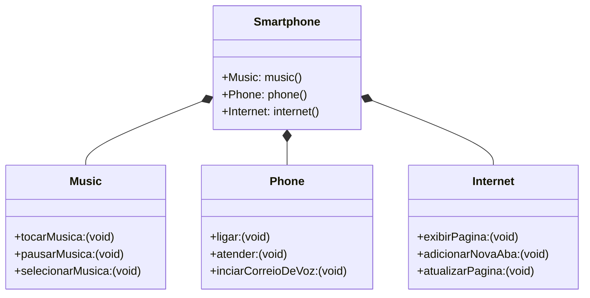

# diagramacao-de-classes-iphone

```mermaid
classDiagram
    class Smartphone {
        +Music: music()
        +Phone: phone()
        +Internet: internet()
    }

    class Music {
        +tocarMusica: (void)
        +pausarMusica: (void)
        +selecionarMusica: (void)
    }

    class Phone {
        +ligar: (void)
        +atender: (void)
        +inciarCorreioDeVoz: (void)
    }

    class Internet {
        +exibirPagina: (void)
        +adicionarNovaAba: (void)
        +atualizarPagina: (void)
    }

    Smartphone *-- Music
    Smartphone *-- Phone
    Smartphone *-- Internet
```
